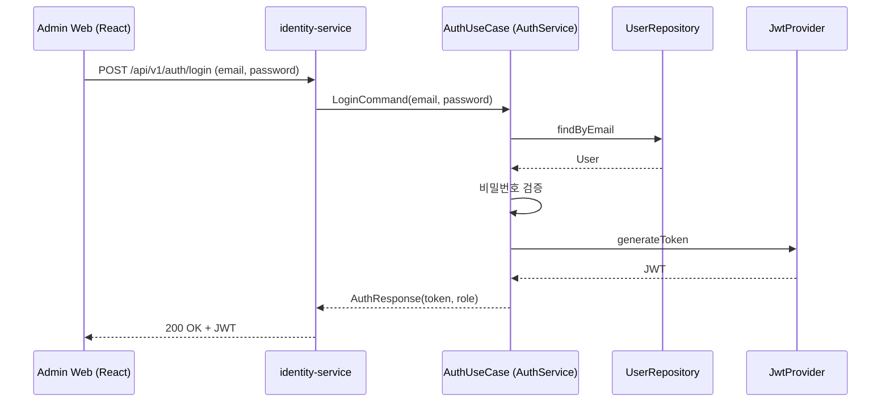
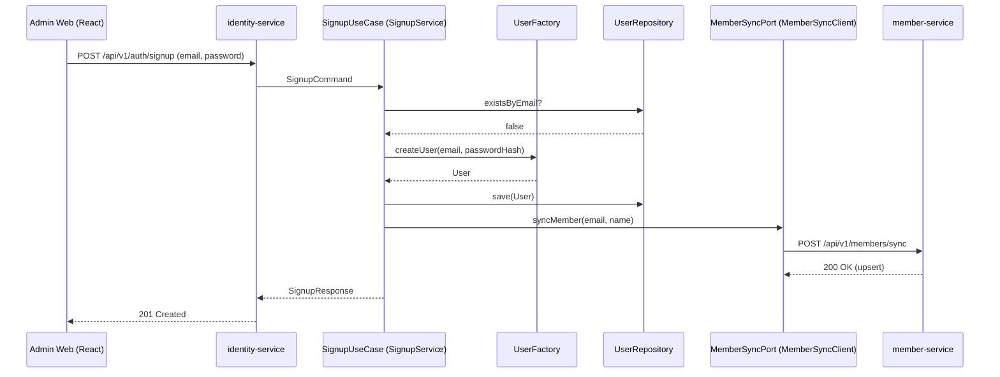
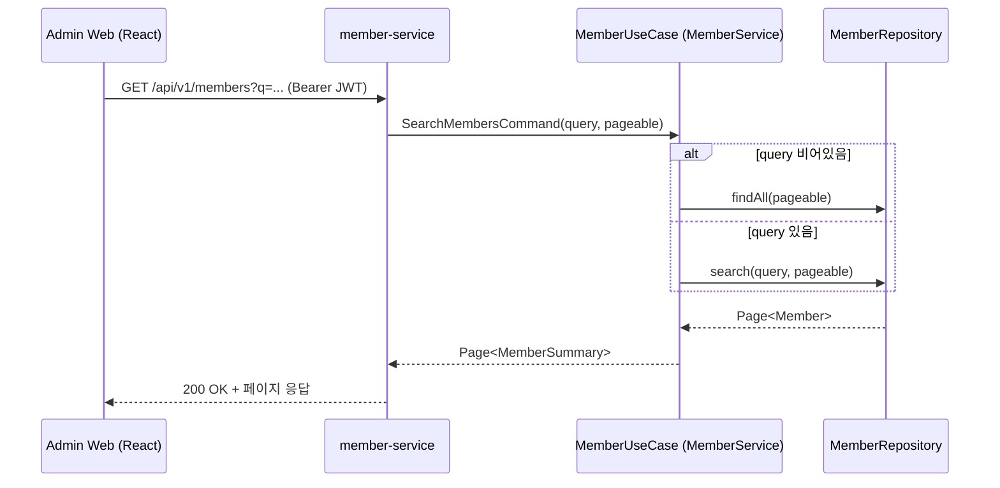

# 시퀀스 다이어그램 (현재 아키텍처)

## 로그인 흐름

```mermaid
sequenceDiagram
    participant UI as Admin Web (React)
    participant AuthAPI as identity-service
    participant AuthUseCase as AuthUseCase (AuthService)
    participant UserRepo as UserRepository
    participant Jwt as JwtProvider

    UI->>AuthAPI: POST /api/v1/auth/login (email, password)
    AuthAPI->>AuthUseCase: LoginCommand(email, password)
    AuthUseCase->>UserRepo: findByEmail
    UserRepo-->>AuthUseCase: User
    AuthUseCase->>AuthUseCase: 비밀번호 검증
    AuthUseCase->>Jwt: generateToken
    Jwt-->>AuthUseCase: JWT
    AuthUseCase-->>AuthAPI: AuthResponse(token, role)
    AuthAPI-->>UI: 200 OK + JWT
```

## 회원가입 + 멤버 동기화

```mermaid
sequenceDiagram
    participant UI as Admin Web (React)
    participant AuthAPI as identity-service
    participant SignupUC as SignupUseCase (SignupService)
    participant UserFactory as UserFactory
    participant UserRepo as UserRepository
    participant MemberSync as MemberSyncPort (MemberSyncClient)
    participant MemberAPI as member-service

    UI->>AuthAPI: POST /api/v1/auth/signup (email, password)
    AuthAPI->>SignupUC: SignupCommand
    SignupUC->>UserRepo: existsByEmail?
    UserRepo-->>SignupUC: false
    SignupUC->>UserFactory: createUser(email, passwordHash)
    UserFactory-->>SignupUC: User
    SignupUC->>UserRepo: save(User)
    SignupUC->>MemberSync: syncMember(email, name)
    MemberSync->>MemberAPI: POST /api/v1/members/sync
    MemberAPI-->>MemberSync: 200 OK (upsert)
    SignupUC-->>AuthAPI: SignupResponse
    AuthAPI-->>UI: 201 Created
```

## 멤버 목록 조회/검색

```mermaid
sequenceDiagram
    participant UI as Admin Web (React)
    participant MemberAPI as member-service
    participant MemberUC as MemberUseCase (MemberService)
    participant MemberRepo as MemberRepository

    UI->>MemberAPI: GET /api/v1/members?q=... (Bearer JWT)
    MemberAPI->>MemberUC: SearchMembersCommand(query, pageable)
    alt query 비어있음
        MemberUC->>MemberRepo: findAll(pageable)
    else query 있음
        MemberUC->>MemberRepo: search(query, pageable)
    end
    MemberRepo-->>MemberUC: Page<Member>
    MemberUC-->>MemberAPI: Page<MemberSummary>
    MemberAPI-->>UI: 200 OK + 페이지 응답
```
